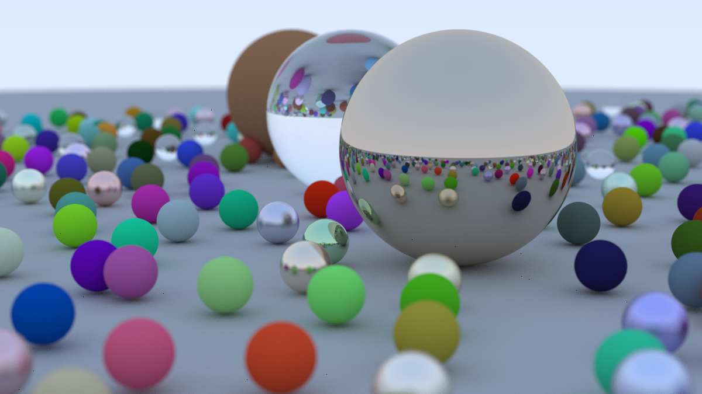

# Ray tracing in zig
Following the tutorial
<https://raytracing.github.io/books/RayTracingInOneWeekend.html>

# Lessons
1. the tutorial lean heavy on inheritance which is not in zig. Learned
   how to implement a custom interface in low level language with
2. faced problems with float-point errors and overcame them by either
   using asserts to validate the assumptions (e.g vec.unit returns a
   unit vector or assert normal vector is a unit one
   [tigerstyle](https://github.com/tigerbeetle/tigerbeetle/blob/main/docs/TIGER_STYLE.md#safety))
   or
   ignore them completely by avoiding close distance interactions
3. Wasted effort trying to use simd without measuring first and turns
   out I targeted the wrong section. Always measure before optimizing
   and Don't optimize debug build.
4. arena allocator are great. Use them to simplify memory model (Thank
   you Casey for the
   [advice](https://www.youtube.com/watch?v=xt1KNDmOYqA))
5. Found it hard to inspect visual defects and the effect of
   parameters like max number of bounces and sampling rate per
   pixel. So I created a visualization tool in raylib and it took alot
   of time but not as much as trying to learn scripting in gimp. I now
   understand the power of lisp and the leverage a repl has.
6. visual studio code is great for viewing markdown before publishing
   to github ;)

# Run
to get the final image install zig version 0.14 and run
`zig build -Doptimize=ReleaseFast run -- --vfov 20 --focus-dist 10 --defocus-angle 0.6 --from 13 2 3 --at 0 0 0 --width 1200 --samples 500 --depth 50 > image.ppm`
or just use the binary `./raytracing` with the above options
